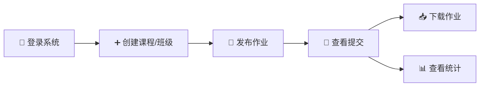
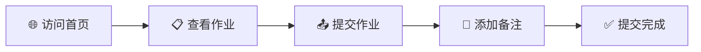

<div align="center">

# 📚 TG-EDU 综合教育平台

*一个现代化、高效的在线教学管理系统*

[](https://opensource.org/licenses/MIT)
[](https://www.python.org/downloads/)
[](https://flask.palletsprojects.com/)
[](https://www.docker.com/)
[](CONTRIBUTING.md)

[功能特性](#-功能特性) •
[快速开始](#-快速开始) •
[高级功能](#-高级功能) •
[配置说明](#️-配置说明) •
[故障排除](#-故障排除)

</div>

---

## 📑 目录

- [功能特性](#-功能特性)
- [快速开始](#-快速开始)
- [技术栈](#️-技术栈)
- [使用指南](#-使用指南)
- [项目结构](#-项目结构)
- [配置说明](#️-配置说明)
- [数据管理](#-数据管理)
- [安全特性](#️-安全特性)
- [性能优化](#-性能优化)
- [高级功能](#-高级功能)
  - [大作业系统 - 多教师管理](#-大作业系统---多教师管理)
  - [阶段管理系统](#-阶段管理系统)
  - [系统测试指南](#-系统测试指南)
  - [功能实现总结](#-功能实现总结)
- [故障排除](#-故障排除)
- [文档](#-文档)
- [贡献指南](#-贡献)
- [开源协议](#-开源协议)
- [作者](#-作者)
- [支持与反馈](#-支持)

---

## ✨ 功能特性

<table>
<tr>
<td width="50%" valign="top">

### 🎓 学生端功能

- 📝 **作业管理** - 查看、提交和追踪作业状态
- 📤 **文件上传** - 支持多种文件格式上传
- 💬 **互动交流** - 为提交内容添加备注说明
- 📊 **学习追踪** - 查看个人学习进度
- 🔔 **实时通知** - 获取作业和课程更新提醒

</td>
<td width="50%" valign="top">

### 👨‍🏫 教师端功能

- 🔐 **权限管理** - 完善的多级权限控制系统
- ➕ **课程管理** - 创建和管理课程、作业
- 📈 **数据分析** - 实时查看学生提交统计
- 📥 **批量操作** - 一键下载所有学生作业
- 👥 **班级管理** - 灵活的班级和学生管理

</td>
</tr>
</table>

### 🌟 核心亮点

<div align="center">

| 特性 | 说明 |
|:---:|:---|
| ⚡ **高性能** | 基于Gevent异步处理，支持100+用户同时在线 |
| 🛡️ **安全可靠** | 文件类型白名单、路径遍历防护、CSRF保护 |
| 💾 **数据持久化** | Docker Volume挂载，数据安全不丢失 |
| 📦 **大文件支持** | 最大支持10GB文件上传 |
| 📱 **响应式设计** | Bootstrap 5适配各种设备 |
| 🚀 **开箱即用** | Docker一键部署，快速上线 |

</div>

---

## 🚀 快速开始

### 📋 环境要求

- 🐳 Docker 20.10+
- 🔧 Docker Compose 1.29+

### 💻 一键部署

<details>
<summary><b>点击展开详细步骤</b></summary>

#### 1️⃣ 克隆项目

```bash
git clone https://github.com/NUDTTAN91/TG-EDU.git
cd TG-EDU
```

#### 2️⃣ 配置环境变量（可选）

您可以直接修改 `docker-compose.yml` 中的环境变量：

```yaml
environment:
  - ADMIN_USERNAME=admin          # 🔑 管理员用户名
  - ADMIN_PASSWORD=your_password  # 🔒 管理员密码（请修改！）
  - SECRET_KEY=your-secret-key    # 🔐 安全密钥（请修改！）
```

> ⚠️ **安全提示**：生产环境请务必修改默认密码和密钥！

#### 3️⃣ 启动服务

```bash
docker-compose up -d
```

#### 4️⃣ 访问系统

🌐 打开浏览器访问：`http://localhost` 或 `http://your-server-ip`

- 👨‍🎓 **学生**：直接访问首页即可查看课程和作业
- 👨‍🏫 **教师**：点击右上角"教师登录"进入管理后台

</details>

---

## 🏗️ 技术栈

<div align="center">

### 后端技术


### 前端技术


### 部署工具


</div>

<details>
<summary><b>详细技术栈</b></summary>

| 类别 | 技术 | 版本 |
|:---:|:---|:---:|
| **语言** | Python | 3.8+ |
| **Web框架** | Flask | 2.3.3 |
| **ORM** | Flask-SQLAlchemy | 3.0.5 |
| **用户认证** | Flask-Login | 0.6.2 |
| **数据库** | SQLite | 3.x |
| **服务器** | Gunicorn + Gevent | 21.2.0 |
| **前端框架** | Bootstrap | 5.x |
| **模板引擎** | Jinja2 | 3.x |
| **容器化** | Docker | Latest |

</details>

---

## 📖 使用指南

### 👨‍🏫 教师操作流程



<details>
<summary><b>详细步骤</b></summary>

1. **登录管理后台**
   - 点击右上角"教师登录"
   - 使用管理员账户登录

2. **创建班级/课程**
   - 在管理后台点击"班级管理"
   - 创建新班级并添加学生

3. **发布作业**
   - 点击"创建新作业"
   - 填写作业标题、描述、截止时间
   - 可上传附件资料

4. **管理提交**
   - 查看学生提交列表
   - 批量下载学生作业
   - 查看提交统计数据

</details>

### 🎓 学生操作流程



<details>
<summary><b>详细步骤</b></summary>

1. **查看作业**
   - 访问系统首页
   - 浏览当前可提交的作业列表
   - 查看作业详情和要求

2. **提交作业**
   - 点击"提交作业"按钮
   - 填写学生信息（姓名、学号）
   - 选择作业文件
   - 添加提交说明（可选）
   - 点击"提交"完成

3. **追踪状态**
   - 查看提交历史
   - 确认提交状态

</details>

---

## 📂 项目结构

```
TG-EDU/
├── 📄 app.py                    # Flask 应用主文件
├── 📋 requirements.txt          # Python 依赖列表
├── 🐳 Dockerfile               # Docker 镜像构建文件
├── 🔧 docker-compose.yml       # Docker Compose 配置
├── 🗄️ init_db.py              # 数据库初始化脚本
├── 📝 start.sh                 # 启动脚本
├── 📚 PERFORMANCE.md           # 性能优化文档
├── 🤝 CONTRIBUTING.md          # 贡献指南
├── 📜 LICENSE                  # MIT 开源协议
├── 📁 app/
│   ├── static/                 # 静态资源
│   │   ├── css/               # 样式文件
│   │   ├── js/                # JavaScript 文件
│   │   └── images/            # 图片资源
│   └── templates/             # HTML 模板
│       ├── base.html          # 基础模板
│       ├── index.html         # 首页
│       ├── login.html         # 登录页
│       └── ...                # 其他页面
├── 💾 storage/                # 统一存储目录（持久化）
│   ├── data/                  # SQLite 数据库
│   ├── uploads/               # 学生作业文件
│   └── appendix/              # 教师附件资料
└── 🔧 .github/                # GitHub 配置
    ├── ISSUE_TEMPLATE/        # Issue 模板
    └── pull_request_template.md  # PR 模板
```

---

## ⚙️ 配置说明

### 🔧 环境变量

| 变量名 | 说明 | 默认值 | 必需 |
|:------|:-----|:------|:----:|
| `ADMIN_USERNAME` | 管理员用户名 | `admin` | ❌ |
| `ADMIN_PASSWORD` | 管理员密码 | `admin123` | ❌ |
| `SECRET_KEY` | Flask 安全密钥 | `dev-secret-key` | ❌ |

> 💡 **提示**：生产环境建议使用环境变量或配置文件管理敏感信息

### 📦 文件上传配置

- **最大文件大小**：10GB（可由教师自定义设置）
- **支持格式**：
  ```
  📄 文档：txt, pdf, doc, docx
  📦 压缩：zip, rar, 7z
  💻 代码：py, java, cpp, c, h, js, html, css
  🎨 其他：根据需求可扩展
  ```

### 🔌 端口配置

- **默认端口**：80
- **修改方式**：编辑 `docker-compose.yml` 中的 ports 配置

---

## 💾 数据管理

### 📊 数据持久化

系统使用 Docker Volume 挂载实现数据持久化：

```
./storage/
├── data/       # 📊 SQLite 数据库文件
├── uploads/    # 📤 学生作业文件
└── appendix/   # 📎 教师附件资料
```

### 💿 数据备份

```bash
# 📦 完整备份
tar czf tg-edu-backup-$(date +%Y%m%d).tar.gz storage/

# 📊 仅备份数据库
cp storage/data/homework.db storage/data/homework.db.backup

# 🔄 恢复数据
tar xzf tg-edu-backup-YYYYMMDD.tar.gz
```

### 🎯 数据管理优势

- ✅ **直接访问** - 数据存储在宿主机，便于管理
- ✅ **简单备份** - 直接复制目录即可
- ✅ **易于迁移** - 复制 `storage/` 目录到新服务器
- ✅ **容器独立** - 容器重启/更新不影响数据
- ✅ **增量备份** - 支持差异化备份策略

---

## 🛡️ 安全特性

<div align="center">

| 安全措施 | 说明 |
|:-------:|:-----|
| 🔐 | **密码哈希** - Werkzeug 安全密码哈希存储 |
| 🛡️ | **CSRF 保护** - Flask 内置跨站请求伪造防护 |
| 📁 | **文件验证** - 白名单机制防止恶意文件上传 |
| 🚫 | **路径保护** - 防止路径遍历攻击 |
| 🔒 | **会话管理** - Flask-Login 安全会话控制 |
| 👤 | **权限控制** - 多级用户权限管理 |

</div>

---

## 🚀 性能优化

系统经过专业性能优化，支持高并发访问：

### 📈 性能指标

- **并发用户**：100+ 同时在线
- **响应时间**：首页 < 1s，登录 < 2s
- **最大连接**：8000 并发连接
- **错误率**：< 1%

### ⚡ 优化措施

- 🔄 Gevent 异步 Worker（8个进程）
- 💾 SQLite 连接池优化（30个连接）
- 📊 查询优化（限制返回数据量）
- 🔁 自动 Worker 重启机制

> 📚 详细性能优化说明请查看 [PERFORMANCE.md](PERFORMANCE.md)

---


## 📚 高级功能


#### 🔑 功能概述

大作业支持由超级管理员直接管理，也可以指定一个或多个教师进行管理。

#### ✨ 主要特性
- **多教师协作**：支持指定多个教师共同管理一个大作业
- **权限分级**：
  - 超级管理员：可管理所有大作业，可指定任意教师
  - 创建者：可管理自己创建的大作业，可修改管理教师列表
  - 管理教师：可管理被指定的大作业，可确认/拒绝团队
  - 普通教师：创建大作业时只能选择自己作为管理者

#### 🛠️ 使用方法

<details>
<summary><b>点击展开详细步骤</b></summary>

**1. 创建大作业时**（超级管理员）：
- 勾选"管理教师"复选框
- 选择一个或多个教师作为管理者
- 如未选择，创建者自动成为管理者

**2. 编辑大作业时**（超级管理员/创建者）：
- 可以添加或移除管理教师
- 班级字段设为只读（不可修改）

**3. 管理教师权限**：
- 查看团队列表
- 确认/拒绝团队
- 处理退组申请
- 不能修改管理教师列表（除非是创建者）

</details>

---

### 📅 阶段管理系统

#### 🔑 功能概述

TG-EDU支持为大作业设置不同阶段，并自动处理相关逻辑。系统提供三种阶段类型：组队阶段、分工阶段和自定义阶段。

#### 📊 阶段类型详解

**1. 组队阶段 (Team Formation)**
- **用途**：让学生自由组队
- **学生操作**：
  - 创建团队并邀请成员
  - 组长请求确认团队
  - 教师确认后团队被锁定
- **自动处理**：
  - 阶段结束时，系统自动将未组队学生随机分配到新团队
  - 自动创建的团队会被立即确认并锁定
  - 所有受影响学生会收到通知

**2. 分工阶段 (Division)**
- **用途**：为团队成员分配具体角色
- **教师操作**：
  - 定义分工角色（如：项目经理、开发员、测试员）
  - 设置角色为"必须"或"可选"
- **学生操作**：
  - 组长为团队成员分配角色
  - 一个成员可以担任多个角色
- **自动处理**：
  - 阶段结束时，系统自动为未分配的"必须角色"随机分配成员
  - 所有受影响成员会收到通知

**3. 自定义阶段 (Custom)**
- **用途**：标记大作业的里程碑或其他重要节点
- **特性**：灵活设置阶段名称和描述，用于跟踪项目进度

#### 👨‍🏫 教师操作流程

<details>
<summary><b>点击展开详细步骤</b></summary>

**1. 创建大作业时预设阶段**
在创建大作业时，可以直接设置组队阶段和分工阶段：

```
步骤1：填写基本信息
  - 作业标题、描述、班级
  - 组队人数范围（最小2人，最大5人）
  - 上传作业要求文件或链接

步骤2：设置作业时间
  - 开始日期：学生可以开始组队的时间
  - 结束日期：大作业的最终截止时间
  - 提交截止时间（可选）

步骤3：预设阶段（可选）
  ✅ 组队阶段
     - 勾选"添加组队阶段"
     - 设置开始和结束时间
  
  ✅ 分工阶段
     - 勾选"添加分工阶段"
     - 设置开始和结束时间
     - 创建后需在阶段管理中添加角色定义
```

**2. 阶段管理**
1. 进入大作业 → 查看分组情况 → 阶段管理
2. 点击"添加阶段"创建新阶段
3. 填写阶段信息（名称、类型、描述、时间）
4. 对于分工阶段，点击"管理分工角色"添加角色

**3. 控制阶段状态**
- **自动更新**：系统根据开始/结束时间自动更新
- **手动激活**：点击"立即激活"启动阶段
- **手动完成**：点击"立即结束"完成阶段并执行自动处理
- **批量更新**：点击"更新阶段状态"按钮触发

</details>

#### 🎓 学生操作流程

<details>
<summary><b>点击展开详细步骤</b></summary>

**组队阶段**
1. 访问大作业详情页
2. 点击"创建团队"成为组长，或等待他人邀请
3. 组长操作：
   - 邀请成员（填写姓名和学号验证）
   - 查看邀请记录
   - 请求确认团队
4. 成员操作：
   - 接受或拒绝邀请
   - 申请退组

**分工阶段**
1. 在团队详情页查看"团队分工"卡片
2. 组长点击"分配角色"
3. 为每个角色选择负责人
4. 必须角色必须分配，可选角色可以不分配
5. 保存后可随时修改（团队锁定前）

</details>

#### 📌 阶段状态说明

- **待开始 (Pending)**：还未到开始时间
- **进行中 (Active)**：已开始但未结束
- **已完成 (Completed)**：已结束并执行了自动处理

#### ⚙️ 自动处理时机

<details>
<summary><b>点击展开触发方式</b></summary>

**自动触发**（需配置定时任务）：
```bash
# 在服务器上设置cron任务，每小时执行一次
0 * * * * cd /app && python3 update_stage_status.py
```

**手动触发**：
- 教师在阶段管理页面点击"更新阶段状态"
- 教师点击"立即结束"按钮

</details>

#### 🔔 通知机制

<details>
<summary><b>点击展开通知场景</b></summary>

系统会在以下情况发送通知：
- 组长请求确认团队 → 通知所有管理教师
- 教师确认团队 → 通知组长和所有成员
- 系统自动分组 → 通知被分配的学生
- 系统自动分配角色 → 通知被分配的成员和组长

</details>

#### ✅ 最佳实践

<details>
<summary><b>点击展开详细内容</b></summary>

**推荐时间安排**：
```
大作业时间：10周（70天）

阶段1 - 组队阶段：第1周（7天）
  └─ 学生自由组队，教师审核团队

阶段2 - 分工阶段：第2周（7天）
  └─ 组长分配团队成员角色

阶段3-8 - 自定义阶段：第3-10周（56天）
  └─ 需求分析、设计、开发、测试等
```

**注意事项**：
1. 所有阶段时间必须在大作业的开始和结束日期之间
2. 建议合理安排各阶段时间，避免重叠
3. 教师确认后团队会被锁定，学生无法调整
4. 分工阶段的角色需在创建后通过"管理分工角色"添加
5. 阶段完成后自动处理逻辑会立即执行，无法撤销

</details>

#### ❓ 常见问题

<details>
<summary><b>点击展开FAQ</b></summary>

**Q: 如果不勾选任何阶段会怎样？**
A: 大作业正常创建，但没有阶段。可以稍后在阶段管理中添加。

**Q: 可以同时勾选组队和分工阶段吗？**
A: 可以！系统会按顺序创建两个阶段。

**Q: 创建后可以修改阶段时间吗？**
A: 可以，在阶段管理页面点击"编辑"即可修改。

**Q: 分工阶段创建后为什么没有角色？**
A: 需要进入"管理分工角色"页面手动添加角色定义。

**Q: 学生没有组队怎么办？**
A: 组队阶段结束时，系统会自动为未组队的学生创建团队并分配。

**Q: 如何修改已确认的团队？**
A: 教师可以在"查看分组情况"页面使用"管理"功能调整团队成员。

</details>

---

### 🧪 系统测试指南

#### 🛠️ 测试前准备

<details>
<summary><b>点击展开测试步骤</b></summary>

**1. 创建测试数据**

创建班级：
```
班级名称：测试班级2025
班级描述：用于测试阶段管理功能
```

创建学生账号（至少6个）：
```
用户名：student1 ~ student6
密码：123456
真实姓名：学生1 ~ 学生6
学号：2025001 ~ 2025006
角色：学生
```

创建教师账号：
```
用户名：teacher1
密码：123456
真实姓名：测试教师
角色：教师
```

</details>

#### 🧐 测试场景

<details>
<summary><b>点击展开测试场景</b></summary>

**场景一：完整的组队阶段测试**

1. 创建大作业（设置开始和结束日期）
2. 创建组队阶段（结束时间设为5分钟后，方便测试）
3. 部分学生组队（student1和student2，student3和student4）
4. 组长请求确认
5. 教师确认团队
6. 手动完成阶段或等待时间到期
7. 验证：未组队学生（student5和student6）被自动分组

**场景二：完整的分工阶段测试**

1. 创建分工阶段
2. 创建分工角色（项目经理-必须、开发工程师-必须、测试工程师-可选）
3. 组长部分分配角色（只分配项目经理，留空开发工程师）
4. 手动完成阶段
5. 验证：未分配的必须角色被自动分配

**场景三：自定义阶段测试**

1. 创建多个自定义阶段（需求分析、系统设计、编码实现）
2. 验证阶段顺序和状态转换
3. 测试手动激活和完成功能

</details>

#### ✅ 验证检查清单

<details>
<summary><b>点击展开检查清单</b></summary>

**组队阶段**：
- [ ] 学生可以创建团队
- [ ] 学生可以邀请成员
- [ ] 组长可以请求确认
- [ ] 教师可以确认团队
- [ ] 确认后团队被锁定
- [ ] 未组队学生被自动分组
- [ ] 自动创建的团队被确认并锁定
- [ ] 所有人收到相应通知

**分工阶段**：
- [ ] 教师可以创建分工角色
- [ ] 可以设置必须/可选角色
- [ ] 组长可以分配角色
- [ ] 必须角色强制要求分配
- [ ] 未分配的必须角色被自动分配
- [ ] 被分配的成员收到通知

**自定义阶段**：
- [ ] 可以创建自定义阶段
- [ ] 阶段按顺序显示
- [ ] 可以编辑和删除阶段

</details>

---

### 📝 功能实现总结

<details>
<summary><b>点击展开详细内容</b></summary>

#### 🎯 已实现功能列表

**基础架构**：
- ✅ 数据库模型扩展（Stage、DivisionRole、TeamDivision）
- ✅ MajorAssignment 添加 start_date、end_date 字段
- ✅ Team 添加 confirmation_requested_at、is_locked 字段
- ✅ 数据库迁移脚本（自动检测和增量迁移）

**阶段管理核心**：
- ✅ 阶段CRUD操作（创建、查看、编辑、删除）
- ✅ 三种阶段类型支持（组队、分工、自定义）
- ✅ 阶段状态管理（pending/active/completed）
- ✅ 手动激活/完成阶段
- ✅ 批量更新阶段状态

**分工阶段**：
- ✅ 教师端分工角色管理
- ✅ 必须/可选角色设置
- ✅ 学生端团队分工展示
- ✅ 组长分工分配功能
- ✅ 自动分配未分配的必须角色

**组队阶段**：
- ✅ 自动分组未组队学生
- ✅ 团队自动确认和锁定
- ✅ 组队阶段状态展示

**通知系统**：
- ✅ 系统自动分组通知
- ✅ 系统自动分配角色通知
- ✅ 组长请求确认通知
- ✅ 教师确认团队通知

**用户界面**：
- ✅ 阶段管理界面（教师端）
- ✅ 分工角色管理界面
- ✅ 团队分工分配界面
- ✅ 阶段进度展示（学生端）
- ✅ 统计数据可视化

**部署和文档**：
- ✅ Docker配置更新
- ✅ 定时任务脚本（update_stage_status.py）
- ✅ 完整使用文档
- ✅ 测试指南

#### 🌟 技术亮点

- **智能自动化**：组队和分工的自动处理逻辑
- **权限分级**：细粒度的权限控制
- **时间管理**：统一的北京时间和UTC转换
- **数据完整性**：外键约束、唯一性约束、级联删除
- **用户体验**：清晰的界面设计、实时状态更新

---

<div align="center">


---

## 🔧 故障排除


<summary><b>常见问题解决方案</b></summary>

### ❌ 无法访问系统

**问题**：浏览器无法打开系统页面

**解决方案**：
```bash
# 检查容器状态
docker-compose ps

# 检查端口占用
netstat -tuln | grep 80

# 查看容器日志
docker-compose logs tg-edu-system
```

### 📤 文件上传失败

**问题**：上传文件时提示错误

**解决方案**：
- 检查文件大小是否超过限制
- 确认文件格式是否在支持列表中
- 查看服务器磁盘空间是否充足

### 🔐 无法登录

**问题**：输入正确密码仍无法登录

**解决方案**：
- 确认用户名和密码正确
- 检查环境变量配置
- 重置管理员密码

### 📊 查看日志

```bash
# 实时查看日志
docker-compose logs -f tg-edu-system

# 查看最近100行日志
docker-compose logs --tail=100 tg-edu-system
```

### 🔄 重置系统

```bash
# ⚠️ 警告：此操作会删除所有数据！
docker-compose down
rm -rf storage/uploads/* storage/data/* storage/appendix/*
docker-compose up -d
```


</details>

---

## 📚 文档

- 📖 [性能优化指南](PERFORMANCE.md) - 系统性能优化详解
- 🤝 [贡献指南](CONTRIBUTING.md) - 如何参与项目开发
- 📝 [变更日志](https://github.com/NUDTTAN91/TG-EDU/commits/main) - 版本更新记录
- 🐛 [问题反馈](https://github.com/NUDTTAN91/TG-EDU/issues) - 提交 Bug 和建议

---

## 🤝 贡献

欢迎各种形式的贡献！无论是 Bug 报告、功能建议，还是代码贡献，我们都非常感谢！

### 💡 如何贡献

1. 🍴 Fork 本仓库
2. 🌿 创建特性分支 (`git checkout -b feature/AmazingFeature`)
3. 💾 提交更改 (`git commit -m 'feat: Add some AmazingFeature'`)
4. 📤 推送到分支 (`git push origin feature/AmazingFeature`)
5. 🎉 开启 Pull Request

> 📋 详细贡献指南请查看 [CONTRIBUTING.md](CONTRIBUTING.md)

### 🎨 贡献类型

- 🐛 Bug 修复
- ✨ 新功能开发
- 📝 文档改进
- 🎨 UI/UX 优化
- ⚡ 性能优化
- 🌍 国际化支持

---

## 📜 开源协议

本项目采用 **MIT License** 开源协议。

### ✅ 您可以

- 💼 **商业使用** - 用于商业项目
- 🔧 **修改** - 修改源代码
- 📦 **分发** - 分发原始或修改版本
- 🔒 **私有使用** - 用于私有项目

### ⚠️ 限制条件

- 📋 保留版权声明和许可声明

详细信息请查看 [LICENSE](LICENSE) 文件。

---

## 👨‍💻 作者

<div align="center">

**NUDTTAN91**

[](https://github.com/NUDTTAN91)
[](https://blog.csdn.net/ZXW_NUDT)

</div>

---

## 🙏 致谢

感谢所有为本项目做出贡献的开发者和使用者！

### 🌟 Star 历史

[](https://starchart.cc/NUDTTAN91/TG-EDU)

---


## 🎆 项目亮点

**⭐ 如果这个项目对您有帮助，请给它一个 Star！⭐**

[](https://github.com/NUDTTAN91/TG-EDU/stargazers)
[](https://github.com/NUDTTAN91/TG-EDU/network/members)
[](https://github.com/NUDTTAN91/TG-EDU/watchers)

---

Made with ❤️ by [NUDTTAN91](https://github.com/NUDTTAN91)

© 2024 TG-EDU. All rights reserved.

</div>

