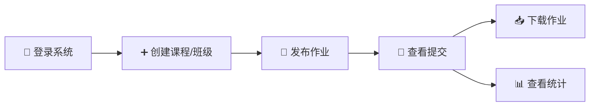
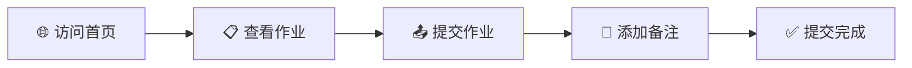

<div align="center">

# 📚 TG-EDU 综合教育平台

*一个现代化、高效的在线教学管理系统*

[](https://opensource.org/licenses/MIT)
[](https://www.python.org/downloads/)
[](https://flask.palletsprojects.com/)
[](https://www.docker.com/)
[](CONTRIBUTING.md)

[功能特性](#-功能特性) •
[快速开始](#-快速开始) •
[技术栈](#️-技术栈) •
[文档](#-文档) •
[贡献](#-贡献)

</div>

---

## ✨ 功能特性

<table>
<tr>
<td width="50%" valign="top">

### 🎓 学生端功能

- 📝 **作业管理** - 查看、提交和追踪作业状态
- 📤 **文件上传** - 支持多种文件格式上传
- 💬 **互动交流** - 为提交内容添加备注说明
- 📊 **学习追踪** - 查看个人学习进度
- 🔔 **实时通知** - 获取作业和课程更新提醒

</td>
<td width="50%" valign="top">

### 👨‍🏫 教师端功能

- 🔐 **权限管理** - 完善的多级权限控制系统
- ➕ **课程管理** - 创建和管理课程、作业
- 📈 **数据分析** - 实时查看学生提交统计
- 📥 **批量操作** - 一键下载所有学生作业
- 👥 **班级管理** - 灵活的班级和学生管理

</td>
</tr>
</table>

### 🌟 核心亮点

<div align="center">

| 特性 | 说明 |
|:---:|:---|
| ⚡ **高性能** | 基于Gevent异步处理，支持100+用户同时在线 |
| 🛡️ **安全可靠** | 文件类型白名单、路径遍历防护、CSRF保护 |
| 💾 **数据持久化** | Docker Volume挂载，数据安全不丢失 |
| 📦 **大文件支持** | 最大支持10GB文件上传 |
| 📱 **响应式设计** | Bootstrap 5适配各种设备 |
| 🚀 **开箱即用** | Docker一键部署，快速上线 |

</div>

---

## 🚀 快速开始

### 📋 环境要求

- 🐳 Docker
- 🔧 Docker Compose

### 💻 部署步骤

<details>
<summary><b>点击展开详细步骤</b></summary>

#### 1️⃣ 克隆项目

```bash
git clone https://github.com/NUDTTAN91/TG-EDU.git
cd TG-EDU
```

#### 2️⃣ 配置环境变量（可选）

您可以直接修改 `docker-compose.yml` 中的环境变量：

```yaml
environment:
  - ADMIN_USERNAME=admin          # 🔑 管理员用户名
  - ADMIN_PASSWORD=your_password  # 🔒 管理员密码（请修改！）
  - SECRET_KEY=your-secret-key    # 🔐 安全密钥（请修改！）
```

> ⚠️ **安全提示**：生产环境请务必修改默认密码和密钥！

#### 3️⃣ 启动服务

```bash
docker-compose up -d
```

#### 4️⃣ 访问系统

🌐 打开浏览器访问：`http://localhost` 或 `http://your-server-ip`

- 👨‍🎓 **学生**：直接访问首页即可查看课程和作业
- 👨‍🏫 **教师**：点击右上角"教师登录"进入管理后台

</details>

---

## 🏗️ 技术栈

<div align="center">

### 后端技术


### 前端技术


### 部署工具


</div>

<details>
<summary><b>详细技术栈</b></summary>

| 类别 | 技术 | 版本 |
|:---:|:---|:---:|
| **语言** | Python | 3.8+ |
| **Web框架** | Flask | 2.3.3 |
| **ORM** | Flask-SQLAlchemy | 3.0.5 |
| **用户认证** | Flask-Login | 0.6.2 |
| **数据库** | SQLite | 3.x |
| **服务器** | Gunicorn + Gevent | 21.2.0 |
| **前端框架** | Bootstrap | 5.x |
| **模板引擎** | Jinja2 | 3.x |
| **容器化** | Docker | Latest |

</details>

---

## 📖 使用指南

### 👨‍🏫 教师操作流程


```mermaid
graph LR
    A[🔐 登录系统] --> B[➕ 创建课程/班级]
    B --> C[📝 发布作业]
    C --> D[👀 查看提交]
    D --> E[📥 下载作业]
    D --> F[📊 查看统计]
```

<details>
<summary><b>详细步骤</b></summary>

1. **登录管理后台**
   - 点击右上角"教师登录"
   - 使用管理员账户登录

2. **创建班级/课程**
   - 在管理后台点击"班级管理"
   - 创建新班级并添加学生

3. **发布作业**
   - 点击"创建新作业"
   - 填写作业标题、描述、截止时间
   - 可上传附件资料

4. **管理提交**
   - 查看学生提交列表
   - 批量下载学生作业
   - 查看提交统计数据

</details>

### 🎓 学生操作流程


```mermaid
graph LR
    A[🌐 访问首页] --> B[📋 查看作业]
    B --> C[📤 提交作业]
    C --> D[💬 添加备注]
    D --> E[✅ 提交完成]
```

<details>
<summary><b>详细步骤</b></summary>

1. **查看作业**
   - 访问系统首页
   - 浏览当前可提交的作业列表
   - 查看作业详情和要求

2. **提交作业**
   - 点击"提交作业"按钮
   - 填写学生信息（姓名、学号）
   - 选择作业文件
   - 添加提交说明（可选）
   - 点击"提交"完成

3. **追踪状态**
   - 查看提交历史
   - 确认提交状态

</details>

---

## 📂 项目结构

```
TG-EDU/
├── 📄 app.py                    # Flask 应用主文件
├── 📋 requirements.txt          # Python 依赖列表
├── 🐳 Dockerfile               # Docker 镜像构建文件
├── 🔧 docker-compose.yml       # Docker Compose 配置
├── 🗄️ init_db.py              # 数据库初始化脚本
├── 📝 start.sh                 # 启动脚本
├── 📚 PERFORMANCE.md           # 性能优化文档
├── 🤝 CONTRIBUTING.md          # 贡献指南
├── 📜 LICENSE                  # MIT 开源协议
├── 📁 app/
│   ├── static/                 # 静态资源
│   │   ├── css/               # 样式文件
│   │   ├── js/                # JavaScript 文件
│   │   └── images/            # 图片资源
│   └── templates/             # HTML 模板
│       ├── base.html          # 基础模板
│       ├── index.html         # 首页
│       ├── login.html         # 登录页
│       └── ...                # 其他页面
├── 💾 storage/                # 统一存储目录（持久化）
│   ├── data/                  # SQLite 数据库
│   ├── uploads/               # 学生作业文件
│   └── appendix/              # 教师附件资料
└── 🔧 .github/                # GitHub 配置
    ├── ISSUE_TEMPLATE/        # Issue 模板
    └── pull_request_template.md  # PR 模板
```

---

## ⚙️ 配置说明

### 🔧 环境变量

| 变量名 | 说明 | 默认值 | 必需 |
|:------|:-----|:------|:----:|
| `ADMIN_USERNAME` | 管理员用户名 | `admin` | ❌ |
| `ADMIN_PASSWORD` | 管理员密码 | `admin123` | ❌ |
| `SECRET_KEY` | Flask 安全密钥 | `dev-secret-key` | ❌ |

> 💡 **提示**：生产环境建议使用环境变量或配置文件管理敏感信息

### 📦 文件上传配置

- **最大文件大小**：10GB（可由教师自定义设置）
- **支持格式**：
  ```
  📄 文档：txt, pdf, doc, docx
  📦 压缩：zip, rar, 7z
  💻 代码：py, java, cpp, c, h, js, html, css
  🎨 其他：根据需求可扩展
  ```

### 🔌 端口配置

- **默认端口**：80
- **修改方式**：编辑 `docker-compose.yml` 中的 ports 配置

---

## 💾 数据管理

### 📊 数据持久化

系统使用 Docker Volume 挂载实现数据持久化：

```
./storage/
├── data/       # 📊 SQLite 数据库文件
├── uploads/    # 📤 学生作业文件
└── appendix/   # 📎 教师附件资料
```

### 💿 数据备份

```bash
# 📦 完整备份
tar czf tg-edu-backup-$(date +%Y%m%d).tar.gz storage/

# 📊 仅备份数据库
cp storage/data/homework.db storage/data/homework.db.backup

# 🔄 恢复数据
tar xzf tg-edu-backup-YYYYMMDD.tar.gz
```

### 🎯 数据管理优势

- ✅ **直接访问** - 数据存储在宿主机，便于管理
- ✅ **简单备份** - 直接复制目录即可
- ✅ **易于迁移** - 复制 `storage/` 目录到新服务器
- ✅ **容器独立** - 容器重启/更新不影响数据
- ✅ **增量备份** - 支持差异化备份策略

---

## 🛡️ 安全特性

<div align="center">

| 安全措施 | 说明 |
|:-------:|:-----|
| 🔐 | **密码哈希** - Werkzeug 安全密码哈希存储 |
| 🛡️ | **CSRF 保护** - Flask 内置跨站请求伪造防护 |
| 📁 | **文件验证** - 白名单机制防止恶意文件上传 |
| 🚫 | **路径保护** - 防止路径遍历攻击 |
| 🔒 | **会话管理** - Flask-Login 安全会话控制 |
| 👤 | **权限控制** - 多级用户权限管理 |

</div>

---

## 🚀 性能优化

系统经过专业性能优化，支持高并发访问：

### 📈 性能指标

- **并发用户**：100+ 同时在线
- **响应时间**：首页 < 1s，登录 < 2s
- **最大连接**：8000 并发连接
- **错误率**：< 1%

### ⚡ 优化措施

- 🔄 Gevent 异步 Worker（8个进程）
- 💾 SQLite 连接池优化（30个连接）
- 📊 查询优化（限制返回数据量）
- 🔁 自动 Worker 重启机制

> 📚 详细性能优化说明请查看 [PERFORMANCE.md](PERFORMANCE.md)

---

## 🔧 故障排除

<details>
<summary><b>常见问题解决方案</b></summary>

### ❌ 无法访问系统

**问题**：浏览器无法打开系统页面

**解决方案**：
```bash
# 检查容器状态
docker-compose ps

# 检查端口占用
netstat -tuln | grep 80

# 查看容器日志
docker-compose logs tg-edu-system
```

### 📤 文件上传失败

**问题**：上传文件时提示错误

**解决方案**：
- 检查文件大小是否超过限制
- 确认文件格式是否在支持列表中
- 查看服务器磁盘空间是否充足

### 🔐 无法登录

**问题**：输入正确密码仍无法登录

**解决方案**：
- 确认用户名和密码正确
- 检查环境变量配置
- 重置管理员密码

### 📊 查看日志

```bash
# 实时查看日志
docker-compose logs -f tg-edu-system

# 查看最近100行日志
docker-compose logs --tail=100 tg-edu-system
```

### 🔄 重置系统

```bash
# ⚠️ 警告：此操作会删除所有数据！
docker-compose down
rm -rf storage/uploads/* storage/data/* storage/appendix/*
docker-compose up -d
```

</details>

---

## 📚 文档

- 📖 [性能优化指南](PERFORMANCE.md) - 系统性能优化详解
- 🤝 [贡献指南](CONTRIBUTING.md) - 如何参与项目开发
- 📝 [变更日志](https://github.com/NUDTTAN91/TG-EDU/commits/main) - 版本更新记录
- 🐛 [问题反馈](https://github.com/NUDTTAN91/TG-EDU/issues) - 提交 Bug 和建议

---

## 🤝 贡献

欢迎各种形式的贡献！无论是 Bug 报告、功能建议，还是代码贡献，我们都非常感谢！

### 💡 如何贡献

1. 🍴 Fork 本仓库
2. 🌿 创建特性分支 (`git checkout -b feature/AmazingFeature`)
3. 💾 提交更改 (`git commit -m 'feat: Add some AmazingFeature'`)
4. 📤 推送到分支 (`git push origin feature/AmazingFeature`)
5. 🎉 开启 Pull Request

> 📋 详细贡献指南请查看 [CONTRIBUTING.md](CONTRIBUTING.md)

### 🎨 贡献类型

- 🐛 Bug 修复
- ✨ 新功能开发
- 📝 文档改进
- 🎨 UI/UX 优化
- ⚡ 性能优化
- 🌍 国际化支持

---

## 📜 开源协议

本项目采用 **MIT License** 开源协议。

### ✅ 您可以

- 💼 **商业使用** - 用于商业项目
- 🔧 **修改** - 修改源代码
- 📦 **分发** - 分发原始或修改版本
- 🔒 **私有使用** - 用于私有项目

### ⚠️ 限制条件

- 📋 保留版权声明和许可声明

详细信息请查看 [LICENSE](LICENSE) 文件。

---

## 👨‍💻 作者

<div align="center">

**NUDTTAN91**

[](https://github.com/NUDTTAN91)
[](https://blog.csdn.net/ZXW_NUDT)

</div>

---

## 🙏 致谢

感谢所有为本项目做出贡献的开发者和使用者！

### 🌟 Star 历史

[](https://starchart.cc/NUDTTAN91/TG-EDU)

---

## 📞 支持

如有问题，请通过以下方式联系：

- 💬 [GitHub Issues](https://github.com/NUDTTAN91/TG-EDU/issues) - 提交 Bug 和功能请求
- 📧 [GitHub Discussions](https://github.com/NUDTTAN91/TG-EDU/discussions) - 讨论和交流
- 📖 [Wiki](https://github.com/NUDTTAN91/TG-EDU/wiki) - 查看详细文档

---

<div align="center">

**⭐ 如果这个项目对您有帮助，请给它一个 Star！⭐**

Made with ❤️ by [NUDTTAN91](https://github.com/NUDTTAN91)

</div>
